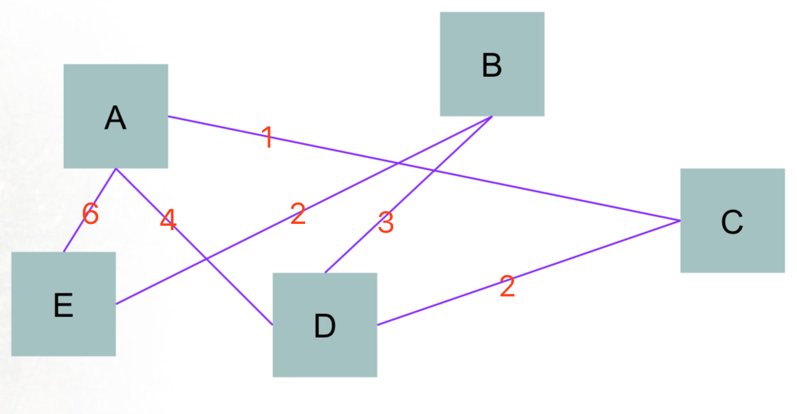

# virtual-routing

 > 基于 Go 语言的虚拟路由程序。

## 一、项目简介

  本程序实现了基于 Go 语言的虚拟路由：
    + 可以在同一电脑上跑多个程序，通过设定不同的端口来模拟路由过程
    + 可以在多个电脑上跑多个程序，通过设定不同的 IP 地址来模拟路由过程

  另外，还可以通过内置的 CLI 实现：
    + 虚拟路由器的基本配置（ip 和 port）
    + 动态设计虚拟路由器之间的拓扑结构，相比于实物连线更为灵活

  通过下面三个模式，对应三个算法来实现路由选择：
    + 分布式的 LS 算法
    + 集中式的 LS 算法
    + 分布式的 DV 算法

## 二、使用方法

  + 获取项目到本地

    `go get -u github.com/painterdrown/virtual-routing`

  + 编译安装可执行文件

    `cd $GOPATH/src/github.com/painterdrown/virtual-routing && go install`

  + 运行程序

    `$GOBIN/virtual-routing <mode>`

    其中，\<mode\> 代表网络的路由算法：
      + 1 代表分布式的 LS 算法
      + 2 代表集中式的 LS 算法
      + 3 代表分布式的 DV 算法

## 三、设计思路

  1. 将一个运行中的程序视为一个虚拟路由器，不同的虚拟路由器之间通过 ip 和 port 来进行区分。同一台电脑上的虚拟路由器之间通过 port 区分，不同电脑上的虚拟路由器通过 ip 区分。

  2. 路由器网络的拓扑结构可以随意配置，比如路由器 A 监听在 3001 端口，路由器 B 监听在 3002 端口，如果在路由器 A 的 CLI 中输入命令：connect 3002 x，则表示在 A, B 之间增加一条费用为 x 的链路。

  3. 通过 TCP 实现不同虚拟路由器之间的信息交流，包括目的明确的信息发送，以及目的不明确的信息广播。

  4. 通过日志来记录虚拟路由器发送、接收信息的情况。

## 四、演示效果

  首先请根据第二步的使用方法，安装好 virtual-routing。

  1. 分布式的 LS 算法

    a. 以 mode 1 的模式运行 5 个虚拟路由程序，通过 port 命令分别设置端口为 3001, 3002, 3003, 3004, 3005

      

    b. 根据下面的拓扑图，通过 connect 命令连接虚拟路由器

      

    

  2. 集中式的 LS 算法

  3. 分布式的 DV 算法

## 四、遇到的问题

  1. 广播循环

  2. 并发

## 五、小组成员

  | 姓名   | 学号      | 负责部分                                       |
  | ----- | -------- | --------------------------------------------- |
  | 郑钊   | 15331424 | 负责项目框架的构建、算法的实现以及测试，实验报告的撰写 |
  | 仲攀   |          | 负责算法的设计                                  |
  | 钟荣柳 |          | 负责算法的设计                                   |
