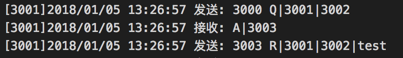

# virtual-routing

 > 基于 Go 语言的虚拟路由程序。

## 一、项目简介

> 开发语言：Go 1.9.2<br/>
> 开发环境：macOS High Sierra 10.13.2<br/>
> Github 地址：[https://github.com/painterdrown/virtual-routing](https://github.com/painterdrown/virtual-routing)

本程序实现了基于 Go 语言的虚拟路由：
  + 可以在同一电脑上跑多个程序，通过设定不同的端口来模拟路由过程
  + 可以在多个电脑上跑多个程序，通过设定不同的 IP 地址来模拟路由过程

另外，还可以通过内置的 CLI 实现：
  + 虚拟路由器的基本配置（ip 和 port）
  + 动态设计虚拟路由器之间的拓扑结构，相比于实物连线更为灵活

通过下面三个模式，对应三个算法来实现路由选择：
  + 分布式的 LS 算法
  + 集中式的 LS 算法
  + 分布式的 DV 算法

## 二、使用方法

  + 获取项目到本地

    `go get -u github.com/painterdrown/virtual-routing`

  + 编译安装可执行文件

    `cd $GOPATH/src/github.com/painterdrown/virtual-routing && go install`

  + 运行程序

    `$GOBIN/virtual-routing <mode>`

    其中，\<mode\> 代表网络的路由算法：
      + 1 代表分布式的 LS 算法
      + 2 代表集中式的 LS 算法
      + 3 代表分布式的 DV 算法

## 三、设计思路

  1. 将一个运行中的程序视为一个虚拟路由器，不同的虚拟路由器之间通过 ip 和 port 来进行区分。同一台电脑上的虚拟路由器之间通过 port 区分，不同电脑上的虚拟路由器通过 ip 区分。

  2. 路由器网络的拓扑结构可以随意配置，比如路由器 A 监听在 3001 端口，路由器 B 监听在 3002 端口，如果在路由器 A 的 CLI 中输入命令：connect 3002 x，则表示在 A, B 之间增加一条费用为 x 的链路。

  3. 通过 TCP 实现不同虚拟路由器之间的信息交流，包括目的明确的信息发送，以及目的不明确的信息广播。

  4. 通过日志来记录虚拟路由器发送、接收信息的情况。

## 四、演示效果

> 首先请根据第二步的使用方法，安装好 virtual-routing（可以在 $GOBIN 目录下查看有无 virtual-routing）。

### 1. 分布式的 LS 算法

> a. 以 mode 1 的模式运行 5 个虚拟路由程序，通过 port 命令分别设置端口为 3001, 3002, 3003, 3004, 3005。分别代表主机 A, B, C, D, E。


> b. 根据下面的拓扑图，通过 connect 命令连接虚拟路由器。注意，比如 A, C 是相连的，只需在 A 的 CLI 中输 connect 命令，不用在 C 中的 CLI 中重复。


> c. 每个路由器都输入 ok 命令，开始工作，可以看到在运行目录下自动生成了 5 个日志文件，打开后可以查看该路由器收发信息的记录。本程序设置的广播时间间隔是 11 秒，更新路由表间隔是 22 秒。当运行程序接近半分钟后，输入 info 命令可以查看虚拟路由器的详细信息。


如图所示，这是虚拟路由器 A 的日志信息：
  + 第 5 行可以看到 A 向邻居发出了广播信息
  + 第 1 行可以看到 A 向 3003(C) 发出了广播信息
  + 第 6 行可以看到 A 接收到了广播信息


    
如图所示，这是虚拟路由器 A 的路由信息：
  + dist 表示最短路径中的花费。
    比如 (3002,6) 表示 3001(A) 到达 3002(B) 的最短路径花费是 6
  + prev 表示最短路径中的上一跳路由器。
    比如 (3002,3004) 表示最短到达 3002(B) 的上一跳路由器是 3004(D)，而再由 (3004,3003), (3003,3001) 可以得到：A 到达 B 的最短路径是：A -> C -> D -> B
  + cost 表示整个网络所有链路之间的花费。
    比如 [3002]: (3004,3)(3005,2) 表示 3002(B) 与 3004(D) 和 3005(E) 之间的链路费用分别是 3 和 2，这与上一步中使用 connect 命令设置的链路费用一致

> d. 路由器 A 发 test 信息给路由器 B，验证最短路径是：A -> C -> D -> B。


可以分别从 A, C, D, B 的日志文件中找到关于 test 信息的转发过程：
  + 第一步，3001(A) 将 test 发给 3003(C)
  + 第二步，3003(C) 收到 test，接着转发给 3004(D)
  + 第三步，3004(D) 收到 test，接着转发给 3002(B)
  + 第四步，3002(B) 收到 test，结束。

> e. shutdown 路由器 D，再由 A 发 test2 信息给 B，验证最短路径更新为：A -> E -> B。


可以分别从 A, E, B 的日志文件中找到关于 test2 信息的转发过程：
  + 第一步，3001(A) 将 test2 发给 3005(E)
  + 第二步，3005(E) 收到 test2，接着转发给 3002(B)
  + 第三步，3002(B) 收到 test2，结束。

### 2. 集中式的 LS 算法

> a. 以 mode 2 的模式运行 5 个虚拟路由程序，通过 port 命令分别设置端口为 3001, 3002, 3003, 3004, 3005, 3000。分别代表主机 A, B, C, D, E 和 controller（右下角）。


> b. 基本配置：用 port 命令指定端口，用 controller 命令指定 controller，用 connect 连接虚拟路由器，最好用 ok 命令让所有虚拟路由器开始工作。


> c. 可以看到在运行目录下自动生成了 6 个日志文件。每台路由器开始工作后，会定期得向 controller 发送自身的路由信息，controller 汇总后，用 LS 算法得出基于所有路由器的最短路径 dist，以及最短路径上的上一跳路由器信息 prev。


使用 controller 的 CLI 输入 info 后可以得到上图所示的信息：
  + dist[3001]: (3002,6)(3001,0)(3005,6)(3003,1)(3004,3) 表明从 3001(A) 到 3002(B), 3001(A), 3005(E), 3003(C), 3004(D) 的最短路径费用分别是：2, 6, 0, 1, 3
  + dist[3005]: (3001,6)(3005,0)(3003,7)(3004,5)(3002,2) 则是基于 3005(E) 的最短路径费用，以此类推
  + prev[3001]: (3005,3001)(3003,3001)(3004,3003)(3001,3001)(3002,3004) 表明从 3001(A) 到达 3005(E), 3003(C), 3004(D), 3001(A), 3002(B) 的最短路径上的上一跳路由器分别是：3001(A), 3001(A), 3003(C), 3001(A), 3004(D)。因此可以得到：A 到达 B 的最短路径是：A -> C -> D -> B（逆推得到），于拓扑图相符。
  + prev[3005]: (3001,3005)(3002,3005)(3005,3005)(3004,3002)(3003,3004) 则是基于 3005(E) 的最短路径上一跳路由器信息，以此类推
  + cost 则是 controller 从其他路由器得到的网络中所以链路上的费用信息


上面是 controller 的日志记录，可以看到：路由器 A, B, C 会定期地向 controller 汇报自己的邻居信息。

> d. 路由器 A 发 test 信息给路由器 B，验证最短路径是：A -> C -> D -> B。



从 A 的日志中可以看出，在发生 test2 时，先向 controller 询问到达 3002(B) 最短路径上的下一跳路由器是 3003(C)，最后 A 把路由信息发给了 C。


从 C 的日志中可以看出，在接收到路由信息 test2 时，先向 controller 询问到达 3002(B) 最短路径上的下一跳路由器是 3004(D)，最后 C 把路由信息发给了 D。


从 D 的日志中可以看出，在接收到路由信息 test2 时，先向 controller 询问到达 3002(B) 最短路径上的下一跳路由器是 3002(B)，最后 D 把路由信息发给了 B。


从 B 的日志中可以看出，B 成功接收到了 test2。


从 controller 的日志中可以看出：A, C, D 依次来询问 A 到 B 最短路径上的下一跳。

> e. shutdown 路由器 D，再由 A 发 test2 信息给 B，验证最短路径更新为：A -> E -> B。


路由器 D 退出之后，再过一段时间，可以看到 controller 的路由信息得到更新。


类似步骤 d， 可以从上图 3001(A), 3005(E), 3002(B) 以及 3000(controller) 的日志信息中看到 A 到 B 的最短路径更新为：A -> E -> B。

### 3. 分布式的 DV 算法

> a. 以 mode 3 的模式运行 5 个虚拟路由程序，使用 port 命令设定好端口，使用 connect 命令连接路由器。


> b. 分别查看各个路由器的日志信息。由于 DV 算法是一个不断迭代的算法，直到路由器与邻居进行了足够的沟通之后，得知去往网络中任意路由器最短路径的下一跳路由器是哪个邻居邻居，这时路由器就稳定下来，不需要再向邻居交流，除非网络的状态发生变化。


可以由日志信息看出，每个路由器在获得与邻居足够多的交流之后，趋于稳定后，不必再向邻居发送本身的路由信息。

> c. 使用 info 命令查看虚拟路由器 A 的路由信息，结果如下图所示。


上图中的信息：
  + all 表示当前网络中所有的路由器
  + near 表示与 3001(A) 为邻居的路由器
  + dist 表示到达某个路由器的最短花费
  + next 表示最短到达某个路由器的下一跳邻居路由器，(3002,3003)，表示 A 最短到达 3002(B) 的最短路径需经过邻居 3003(C)

> d. 路由器 A 发 test 信息给路由器 B，验证最短路径是：A -> C -> D -> B。


根据上面的 4 张日志记录截图可以看出，由 A 发送 test 给 B 的路由为：3001(A) -> 3003(C) -> 3004(D) -> 3002(B)，相符。

## 四、遇到的问题

### 1. 广播的问题

在分布式的 LS 算法下，是通过广播的机制来分享网络中的路由信息的。但是在代码实现广播的过程中，要避免循环广播、以及避免重复接收广播的问题。以下面的拓扑图为例：


路由器 A 一开始会将自己的路由信息同时广播给 C, D, E（因为 C, D, E 是 A 的邻居），然后 C 收到该广播信息后，会继续向 C 的邻居广播该信息，其中就包括已经广播过的 D。那么，D 如何做到在收到 A, C 发来的同一条广播信息的同时，只处理一次，并且不会把广播发回 A，形成循环呢？

这里我想到了给每条广播信息附上唯一 ID 的方法，在 A 一开始生成广播信息时，就为该信息生成一个唯一的 ID，然后再发送出去。其他路由器接收到该广播信息之后，先获取广播的 ID，检查本地存储中是否存在该 ID，如果是则忽略不处理；如果不是，则存储该 ID，然后继续向邻居转发该广播信息。

这里我采用的生成 ID 的方式是通过获取纳秒级别的时间戳，这样就可以保证不同广播之间的唯一性。

### 2. 并发的问题

再如上面的拓扑图所示，D, E 很有可能会在短时间内都给 B 发送路由信息。这时 B 就会开不同的两个 Go 程去处理这件事情。在处理的时候，两个 Go 程要对某些变量进行读写操作，这时候就很容易报出“并发读写”的异常，这个我一开始在 Debug 的时候就经常遇到，也是我第一次编程时遇到并发读写的错误。

不过这个问题很好解决，Go 语言也提供了很方便的用于 Go 程之间同步的支持，比如互斥锁的使用就十分简单：

```Go
import "sync"
var lock = new(sync.Mutex)
lock.Lock()
// 临界区
lock.Unlock()
```

因此，解决这个问题，只需要在涉及并发读写的程序语句（临界区）前后加锁，就可以解决了。

## 五、小组成员

  | 姓名   | 学号      | 负责部分                                       |
  | ----- | -------- | --------------------------------------------- |
  | 郑钊   | 15331424 | 负责项目框架的构建、算法的实现以及测试，实验报告的撰写 |
  | 仲攀   | 15331430 | 负责算法的设计                                  |
  | 钟荣柳 |          | 负责算法的设计                                   |
