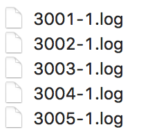

# virtual-routing

 > 基于 Go 语言的虚拟路由程序。

## 一、项目简介

  本程序实现了基于 Go 语言的虚拟路由：
    + 可以在同一电脑上跑多个程序，通过设定不同的端口来模拟路由过程
    + 可以在多个电脑上跑多个程序，通过设定不同的 IP 地址来模拟路由过程

  另外，还可以通过内置的 CLI 实现：
    + 虚拟路由器的基本配置（ip 和 port）
    + 动态设计虚拟路由器之间的拓扑结构，相比于实物连线更为灵活

  通过下面三个模式，对应三个算法来实现路由选择：
    + 分布式的 LS 算法
    + 集中式的 LS 算法
    + 分布式的 DV 算法

## 二、使用方法

  + 获取项目到本地

    `go get -u github.com/painterdrown/virtual-routing`

  + 编译安装可执行文件

    `cd $GOPATH/src/github.com/painterdrown/virtual-routing && go install`

  + 运行程序

    `$GOBIN/virtual-routing <mode>`

    其中，\<mode\> 代表网络的路由算法：
      + 1 代表分布式的 LS 算法
      + 2 代表集中式的 LS 算法
      + 3 代表分布式的 DV 算法

## 三、设计思路

  1. 将一个运行中的程序视为一个虚拟路由器，不同的虚拟路由器之间通过 ip 和 port 来进行区分。同一台电脑上的虚拟路由器之间通过 port 区分，不同电脑上的虚拟路由器通过 ip 区分。

  2. 路由器网络的拓扑结构可以随意配置，比如路由器 A 监听在 3001 端口，路由器 B 监听在 3002 端口，如果在路由器 A 的 CLI 中输入命令：connect 3002 x，则表示在 A, B 之间增加一条费用为 x 的链路。

  3. 通过 TCP 实现不同虚拟路由器之间的信息交流，包括目的明确的信息发送，以及目的不明确的信息广播。

  4. 通过日志来记录虚拟路由器发送、接收信息的情况。

## 四、演示效果

  首先请根据第二步的使用方法，安装好 virtual-routing。

  1. 分布式的 LS 算法

    a. 以 mode 1 的模式运行 5 个虚拟路由程序，通过 port 命令分别设置端口为 3001, 3002, 3003, 3004, 3005。分别代表主机 A, B, C, D, E。

    b. 根据下面的拓扑图，通过 connect 命令连接虚拟路由器。注意，比如 A, C 是相连的，只需在 A 的 CLI 中输 connect 命令，不用在 C 中的 CLI 中重复。

    c. 每个路由器都输入 ok 命令，开始工作，可以看到在运行目录下自动生成了 5 个日志文件，打开后可以查看该路由器收发信息的记录。本程序设置的广播时间间隔是 11 秒，更新路由表间隔是 22 秒。当运行程序接近半分钟后，输入 info 命令可以查看虚拟路由器的详细信息。

如图所示，这是虚拟路由器 A 的日志信息：
  + 第 5 行可以看到 A 向邻居发出了广播信息
  + 第 1 行可以看到 A 向 3003(C) 发出了广播信息
  + 第 6 行可以看到 A 接收到了广播信息

    
如图所示，这是虚拟路由器 A 的路由信息：
  + dist 表示最短路径中的花费。
    比如 (3002,6) 表示 3001(A) 到达 3002(B) 的最短路径花费是 6。
  + prev 表示最短路径中的上一跳路由器。
    比如 (3002,3004) 表示最短到达 3002(B) 的上一跳路由器是 3004(D)，而再由 (3004,3003), (3003,3001) 可以得到：A 到达 B 的最短路径是：A -> C -> D -> B。
  + cost 表示整个网络所有链路之间的花费。
    比如 [3002]: (3004,3)(3005,2) 表示 3002(B) 与 3004(D) 和 3005(E) 之间的链路费用分别是 3 和 2，这与上一步中使用 connect 命令设置的链路费用一致。

    d. 测试路由器 A 发 test 信息给路由器 B，验证最短路径是：A -> C -> D -> B。

可以分别从 A, C, D, B 的日志文件中找到关于 test 信息的转发过程：
  + 第一步，3001(A) 将 test 发给 3003(C)
  + 第二步，3003(C) 收到 test，接着转发给 3004(D)
  + 第三步，3004(D) 收到 test，接着转发给 3002(B)
  + 第四步，3002(B) 收到 test，结束。

    e. shutdown 路由器 D，再由 A 发 test2 信息给 B，验证最短路径更新为：A -> E -> B。

可以分别从 A, E, B 的日志文件中找到关于 test2 信息的转发过程：
  + 第一步，3001(A) 将 test2 发给 3005(E)
  + 第二步，3005(E) 收到 test2，接着转发给 3002(B)
  + 第三步，3002(B) 收到 test2，结束。

  2. 集中式的 LS 算法

  3. 分布式的 DV 算法

## 四、遇到的问题

  1. 广播循环

  2. 并发

## 五、小组成员

  | 姓名   | 学号      | 负责部分                                       |
  | ----- | -------- | --------------------------------------------- |
  | 郑钊   | 15331424 | 负责项目框架的构建、算法的实现以及测试，实验报告的撰写 |
  | 仲攀   |          | 负责算法的设计                                  |
  | 钟荣柳 |          | 负责算法的设计                                   |
